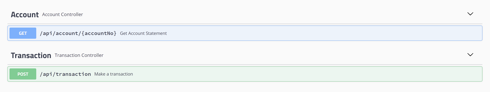
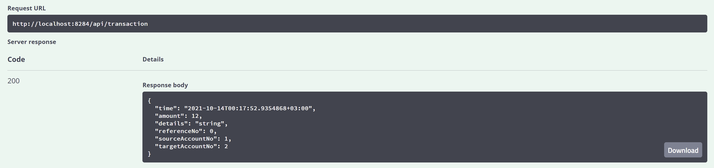
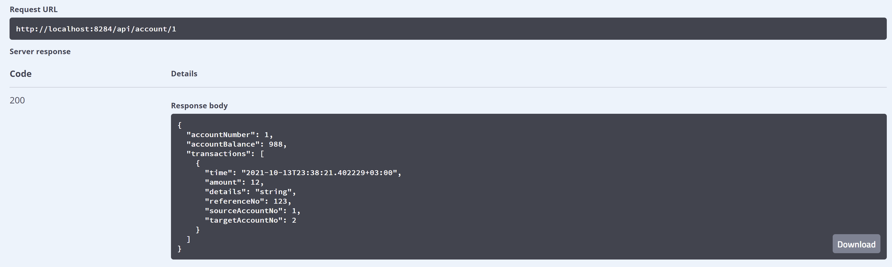
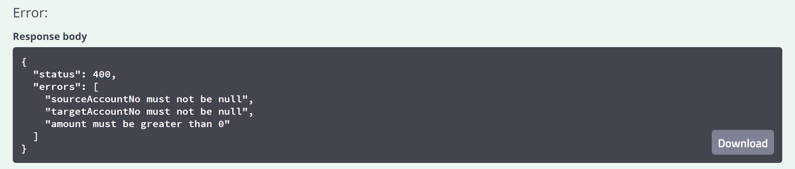
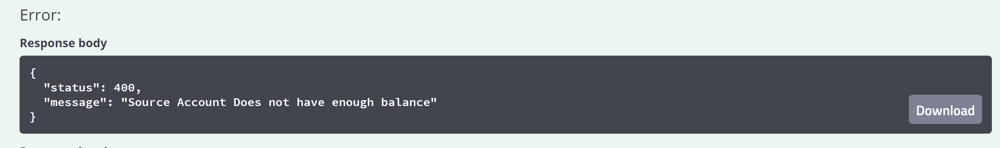
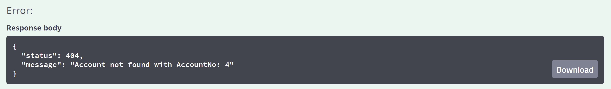
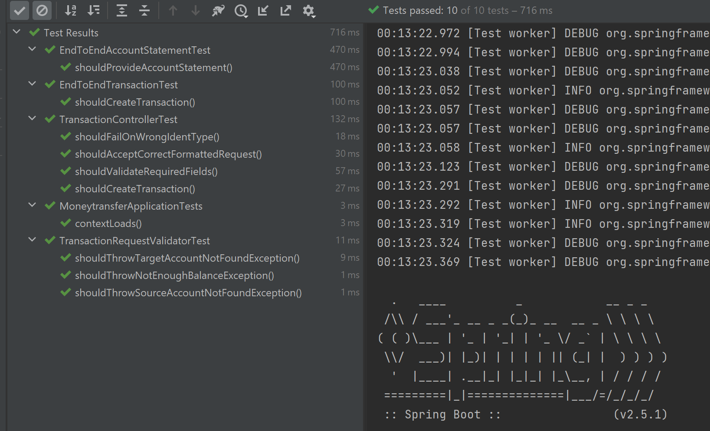

# Banking-Api

## Description

This code repository implements a sandbox Java banking application with REST API with following basic use cases: 

  ● Sending money between two predefined accounts with a positive starting balance
  
  ● Requesting account balance and list of transactions

### Requirements:

- Docker-Compose 1.28
- Gradle
- Java

### Starting(Application has to be run with dev profile):

Step 1: run `docker-compose up` as a terminal command in the root of Project/repository

Step 2:

- run `gradle bootRun --args='--spring.profiles.active=dev' --stacktrace` in the root of repository        
  OR:
- Open in IntelliJ, add 'dev' to active profiles and run ApiApplication

### Swagger API Documentation

[http://localhost:8284/swagger-ui.html](http://localhost:8284/swagger-ui.html)

### Examples of Api Usage

### Possible Next Steps/Things to improve:

- Allow for transactions/operations upto only 2 decimal places for account balance and transaction amounts
- Optimise service methods for minimising database connections

### Error Snapshots

